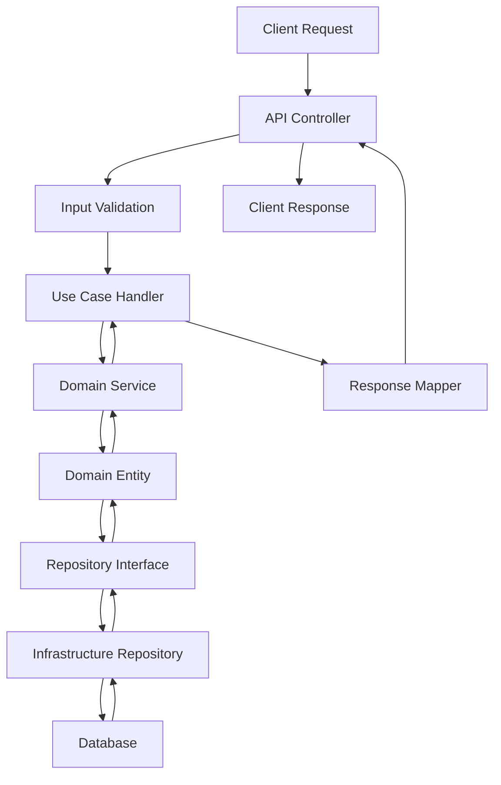

# Backend Architecture Overview

## Clean Architecture Implementation

This document provides a comprehensive overview of the backend API architecture following Clean Architecture principles.

## Architecture Layers

### 1. Domain Layer (Core)
- **Entities**: Core business objects with business rules
- **Value Objects**: Immutable objects representing descriptive aspects
- **Domain Services**: Business logic that doesn't belong to entities
- **Repository Interfaces**: Data access contracts
- **Use Cases Interfaces**: Application business rules contracts

```
/domain
├── entities/
├── value-objects/
├── services/
├── repositories/
└── use-cases/
```

### 2. Application Layer (Use Cases)
- **Use Cases**: Application-specific business rules
- **DTOs**: Data Transfer Objects for inter-layer communication
- **Services**: Application services orchestrating domain operations
- **Handlers**: Command and query handlers

```
/application
├── use-cases/
├── dtos/
├── services/
├── handlers/
└── interfaces/
```

### 3. Infrastructure Layer
- **Repositories**: Data access implementations
- **External Services**: Third-party integrations
- **Database Context**: ORM configurations
- **Messaging**: Event handling and messaging

```
/infrastructure
├── repositories/
├── services/
├── database/
├── messaging/
└── external/
```

### 4. Presentation Layer (API)
- **Controllers**: HTTP request handlers
- **Middleware**: Cross-cutting concerns
- **DTOs**: API-specific data transfer objects
- **Validators**: Input validation logic

```
/api
├── controllers/
├── middleware/
├── dtos/
├── validators/
└── routes/
```

## API Endpoints Structure

### Authentication & Authorization
```http
POST   /api/auth/login
POST   /api/auth/register
POST   /api/auth/refresh
DELETE /api/auth/logout
GET    /api/auth/profile
PUT    /api/auth/profile
```

### User Management
```http
GET    /api/users                 # Get all users (admin)
GET    /api/users/{id}           # Get user by ID
PUT    /api/users/{id}           # Update user
DELETE /api/users/{id}           # Delete user (admin)
GET    /api/users/{id}/profile   # Get user profile
```

### Service Management
```http
GET    /api/services              # List services
POST   /api/services              # Create service
GET    /api/services/{id}         # Get service details
PUT    /api/services/{id}         # Update service
DELETE /api/services/{id}         # Delete service
GET    /api/services/categories   # Get service categories
```

### Booking Management
```http
GET    /api/bookings              # List user bookings
POST   /api/bookings              # Create booking
GET    /api/bookings/{id}         # Get booking details
PUT    /api/bookings/{id}         # Update booking
DELETE /api/bookings/{id}         # Cancel booking
GET    /api/bookings/{id}/status  # Get booking status
PUT    /api/bookings/{id}/status  # Update booking status
```

## Data Flow Architecture



## Dependency Injection Structure

### Core Dependencies
```typescript
// Domain Services
container.register('UserDomainService', UserDomainService);
container.register('BookingDomainService', BookingDomainService);

// Use Cases
container.register('CreateUserUseCase', CreateUserUseCase);
container.register('CreateBookingUseCase', CreateBookingUseCase);

// Repositories
container.register('UserRepository', SqlUserRepository);
container.register('BookingRepository', SqlBookingRepository);
```

## API Request/Response Examples

### Create User
```http
POST /api/users
Content-Type: application/json

{
  "email": "user@example.com",
  "password": "securePassword123",
  "firstName": "John",
  "lastName": "Doe",
  "phone": "+48123456789"
}
```

**Response:**
```json
{
  "success": true,
  "data": {
    "id": "uuid-here",
    "email": "user@example.com",
    "firstName": "John",
    "lastName": "Doe",
    "phone": "+48123456789",
    "createdAt": "2024-01-15T10:00:00Z",
    "updatedAt": "2024-01-15T10:00:00Z"
  }
}
```

### Create Booking
```http
POST /api/bookings
Authorization: Bearer {jwt-token}
Content-Type: application/json

{
  "serviceId": "service-uuid",
  "scheduledDate": "2024-01-20T14:00:00Z",
  "notes": "Urgent repair needed",
  "address": {
    "street": "Main Street 123",
    "city": "Warsaw",
    "postalCode": "00-001"
  }
}
```

**Response:**
```json
{
  "success": true,
  "data": {
    "id": "booking-uuid",
    "serviceId": "service-uuid",
    "userId": "user-uuid",
    "status": "pending",
    "scheduledDate": "2024-01-20T14:00:00Z",
    "notes": "Urgent repair needed",
    "address": {
      "street": "Main Street 123",
      "city": "Warsaw",
      "postalCode": "00-001"
    },
    "createdAt": "2024-01-15T10:00:00Z",
    "estimatedPrice": 150.00,
    "currency": "PLN"
  }
}
```

## Error Handling

### Standard Error Response
```json
{
  "success": false,
  "error": {
    "code": "VALIDATION_ERROR",
    "message": "Invalid input data",
    "details": [
      {
        "field": "email",
        "message": "Email format is invalid"
      }
    ],
    "timestamp": "2024-01-15T10:00:00Z",
    "requestId": "req-uuid"
  }
}
```

### HTTP Status Codes
- `200` - Success
- `201` - Created
- `400` - Bad Request
- `401` - Unauthorized
- `403` - Forbidden
- `404` - Not Found
- `409` - Conflict
- `422` - Unprocessable Entity
- `500` - Internal Server Error

## Security Implementation

### Authentication Flow
1. User provides credentials
2. Server validates credentials
3. JWT token generated with claims
4. Token returned to client
5. Client includes token in subsequent requests

### Authorization Middleware
```typescript
// Role-based access control
@Roles(['admin', 'user'])
@Controller('api/users')
export class UserController {
  // Controller methods
}
```

## Database Schema Overview

### Users Table
```sql
CREATE TABLE users (
  id UUID PRIMARY KEY DEFAULT gen_random_uuid(),
  email VARCHAR(255) UNIQUE NOT NULL,
  password_hash VARCHAR(255) NOT NULL,
  first_name VARCHAR(100) NOT NULL,
  last_name VARCHAR(100) NOT NULL,
  phone VARCHAR(20),
  role VARCHAR(50) DEFAULT 'user',
  created_at TIMESTAMP DEFAULT CURRENT_TIMESTAMP,
  updated_at TIMESTAMP DEFAULT CURRENT_TIMESTAMP
);
```

### Services Table
```sql
CREATE TABLE services (
  id UUID PRIMARY KEY DEFAULT gen_random_uuid(),
  name VARCHAR(255) NOT NULL,
  description TEXT,
  category VARCHAR(100) NOT NULL,
  base_price DECIMAL(10,2),
  duration_minutes INTEGER,
  is_active BOOLEAN DEFAULT true,
  created_at TIMESTAMP DEFAULT CURRENT_TIMESTAMP,
  updated_at TIMESTAMP DEFAULT CURRENT_TIMESTAMP
);
```

### Bookings Table
```sql
CREATE TABLE bookings (
  id UUID PRIMARY KEY DEFAULT gen_random_uuid(),
  user_id UUID REFERENCES users(id),
  service_id UUID REFERENCES services(id),
  status VARCHAR(50) DEFAULT 'pending',
  scheduled_date TIMESTAMP NOT NULL,
  notes TEXT,
  address JSONB,
  estimated_price DECIMAL(10,2),
  final_price DECIMAL(10,2),
  created_at TIMESTAMP DEFAULT CURRENT_TIMESTAMP,
  updated_at TIMESTAMP DEFAULT CURRENT_TIMESTAMP
);
```

## Testing Strategy

### Unit Tests
- Domain entities and value objects
- Use case handlers
- Domain services
- Repository implementations

### Integration Tests
- API endpoints
- Database operations
- External service integrations

### End-to-End Tests
- Complete user workflows
- Authentication flows
- Booking processes

For full conventions and detailed guidelines see `testing-overview.md`.

## Deployment Architecture

### Environment Configuration
```yaml
# docker-compose.yml
version: '3.8'
services:
  api:
    build: .
    ports:
      - "3000:3000"
    environment:
      - NODE_ENV=production
      - DATABASE_URL=postgresql://...
      - JWT_SECRET=...
    depends_on:
      - postgres
      - redis

  postgres:
    image: postgres:15
    environment:
      POSTGRES_DB: obsluga_it
      POSTGRES_USER: ${DB_USER}
      POSTGRES_PASSWORD: ${DB_PASSWORD}

  redis:
    image: redis:7-alpine
```

## Performance Considerations

### Caching Strategy
- Redis for session storage
- Query result caching
- API response caching

### Database Optimization
- Proper indexing
- Connection pooling
- Query optimization

### API Rate Limiting
```typescript
@RateLimit({
  windowMs: 15 * 60 * 1000, // 15 minutes
  max: 100 // limit each IP to 100 requests per windowMs
})
```

## Monitoring & Logging

### Health Checks
```http
GET /health
GET /health/db
GET /health/redis
```

### Logging Structure
```json
{
  "timestamp": "2024-01-15T10:00:00Z",
  "level": "info",
  "message": "User created successfully",
  "requestId": "req-uuid",
  "userId": "user-uuid",
  "duration": 150,
  "metadata": {
    "endpoint": "/api/users",
    "method": "POST"
  }
}
```

## Development Guidelines

### Code Standards
- TypeScript strict mode
- ESLint configuration
- Prettier formatting
- Husky pre-commit hooks

### Git Workflow
- Feature branches
- Pull request reviews
- Automated testing
- Semantic versioning

---

This architecture follows Clean Architecture principles ensuring:
- **Independence**: Business rules independent of frameworks
- **Testability**: Easy to test business logic
- **Maintainability**: Clear separation of concerns
- **Flexibility**: Easy to change external dependencies
